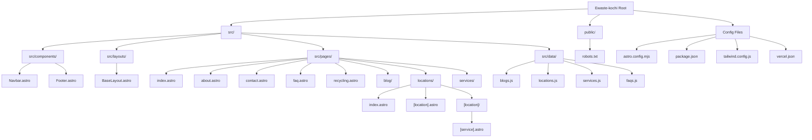

# Project Structure Diagram: Ewaste-kochi

This project is built using Astro 5, designed for programmatic SEO with a focus on locations and services.

## Visual Sitemap & File Structure

## Key Directories and Roles

| Directory | Description |
| :--- | :--- |
| `src/pages/` | Contains the routing logic. Uses dynamic parameters `[location]` and `[service]` for programmatic page generation. |
| `src/data/` | The "brain" of the project. Contains JavaScript modules that supply data for locations, services, blogs, and FAQs. |
| `src/components/` | Reusable Astro components like the `Navbar` and `Footer`. |
| `src/layouts/` | Page wrappers like `BaseLayout.astro` which provide uniform structure (HTML head, scripts, etc.). |
| `public/` | Static assets and server-level files (e.g., `robots.txt`). |

## Programmatic Routing Strategy

The site uses a powerful dynamic routing pattern:
- **Location Pages**: /locations/[location]
- **Location-Specific Service Pages**: /locations/[location]/[service]
- **Global Service Pages**: /services/[service] (implied by the `services/` directory)

This allows the application to generate hundreds of optimized SEO pages from a single source of truth in the `src/data/` directory.
